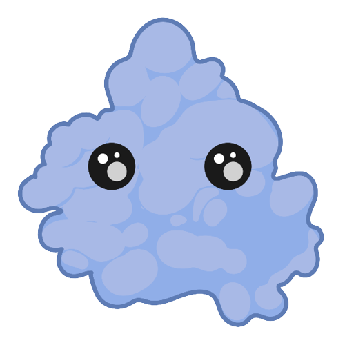

# ProteinGO!
To run the game, simply install `pygame` and execute the python script from the root of the repository:
```
pip install pygame
python ProteinGO.py
```
You also need the 'resource' folder in the same directory

## Rules


## What is it about?
Two devastating diseases I am studying at the Polymendidou lab, **Amyotrophic lateral sclerosis (ALS)** and **Frontotemporal Dementia (FTD)** have a key feature in common- the pathological transition of the protein **TDP-43**. 


TDP-43 is a key protein involved in many cellular processes, among the studied ones, many are **RNA** 


 
related. <br> 
This is expected because the protein possese structural motifs that facilitate binding to RNAs. 

Pathologies in the two diseases, particualry FTD, can highly differ among subtypes and the exact pathological mechanism is still being investigated, but a decisive clue we have is that, often upon examination of patient brains, we could find the protein in an abnormaly aggregated form. 


This suggests that the protein was being sequestered from where it's normalily found in a heathy neuron, and thus the capacity for it to perform it's various physiological function (often RNA related) has been reduced, leading to dysfunctions in the brain area affected. 

Our cells constantly produce a lot of proteins and sometimes there are errors that naturally happens, or because of external stimuli, causing some proteins to misfold and form aggregates. But (usually) worry not! Our cells are equipped with a system that can handle these situations- **Proteasomes**. 

Proteasomes are machineries that could clear out detrimental proteins and serve an important function in maintaining the homeostasis in our cells. 
Unfortunately, sometimes under disease conditions there could be defects in the proteasomal system, contributing to the disease development.


## Credits

